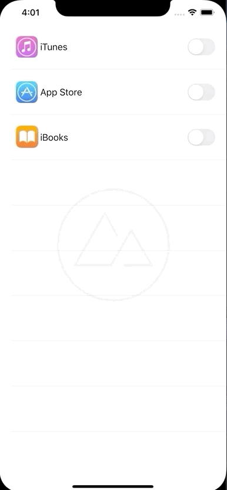

# Settings

Settings is a project designed to help students practice working with intermediate table view concepts, creating protocols, and implementing MVC patterns.

<<<<<<< HEAD

=======

>>>>>>> 630aa98155c65357bb2bd07e81c6386e4cf2f019
